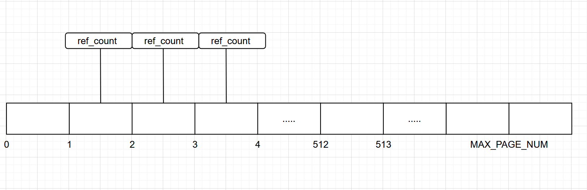
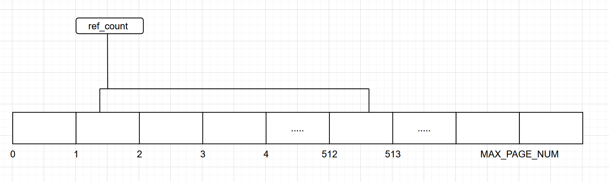
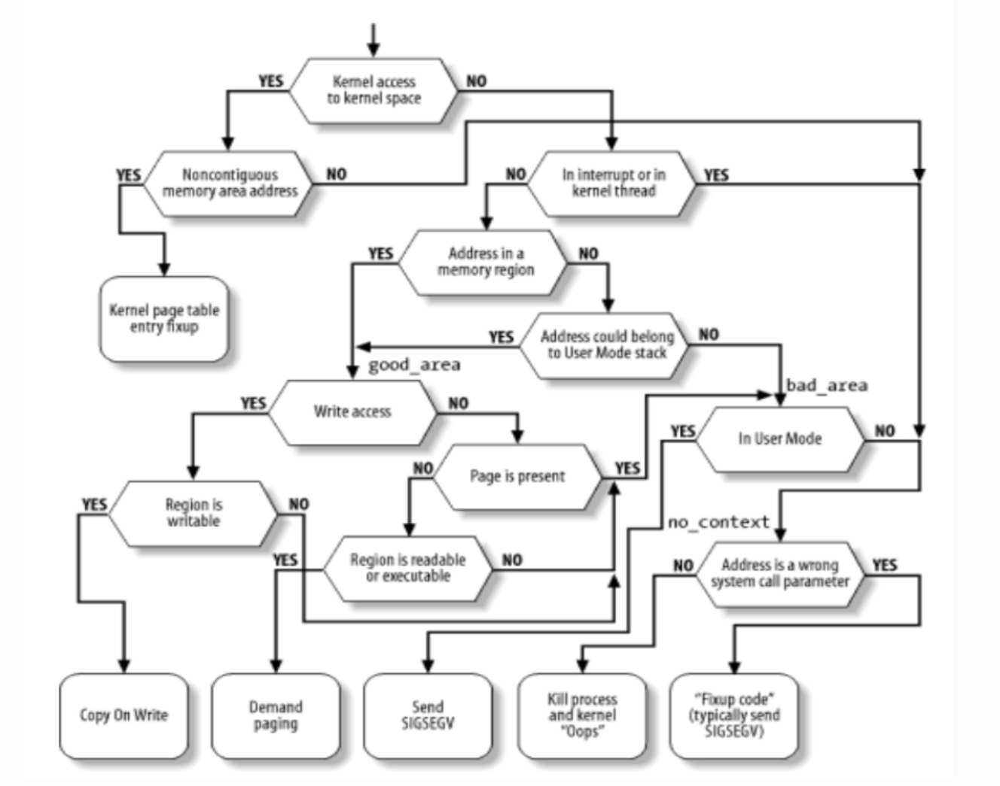

# 为 Starry-next 提供 Copy On Write 支持

报告人： 苏博文

**2025春夏操作系统训练营**

---
## 目录

- [介绍](#介绍)

- [实现](#实现)

- [进展](#进展)

- [总结](#总结)

---
## 介绍

### Copy On Write

>写时复制（Copy-on-write，简称COW）是一种计算机程序设计领域的优化策略。其核心思想是，如果有多个调用者（callers）同时请求相同资源（如内存或磁盘上的数据存储），他们会共同获取相同的指针指向相同的资源，直到某个调用者试图修改资源的内容时，系统才会真正复制一份专用副本（private copy）给该调用者，而其他调用者所见到的最初的资源仍然保持不变。这过程对其他的调用者都是透明的。此作法主要的优点是如果调用者没有修改该资源，就不会有副本（private copy）被创建，因此多个调用者只是读取操作时可以共享同一份资源。

### 目标

简单，可扩展的 Copy on write

---

## 实现

### 引用计数

在 arceos 启动，分配一张全局的数组记录所有物理页帧的信息，使用物理页号作为索引。

```rust
pub(crate) struct FrameRefTable {
    data: Box<[FrameInfo; MAX_FRAME_NUM]>,
}

pub(crate) struct FrameInfo {
    ref_count: AtomicUsize,
}
```

---

对于 4k 页，每一页对应数组的一个位置。


---

对于大页（以 2M 大页为例），每一个 2M 大页对应了连续 512 项的数组元素，但是信息存储在第一个元素上。需要查看信息时，索引需要对齐到开始的物理地址所对应的物理页号。


---
### clone

删除 pte 中的 写flag， 保留 vma 中的 写flag, 方便缺页处理时判断该区是否可写 

```rust
let cow_flags = area.flags() - MappingFlags::WRITE;

frame_table().inc_ref(paddr);

self.pt
    .protect(vaddr, cow_flags)
    .map(|(_, tlb)| tlb.flush())
new_aspace
    .pt
    .map(vaddr, paddr, page_size, cow_flags)
    .map(|tlb| tlb.flush())

```

---
### 缺页处理

对内存进行写访问，并且内存区域是可写的，可以触发 cow 缺页。



<!--  -->

---
### page_table_multiarch 中的错误

aarch64 tlb 刷新问题。

https://github.com/Mivik/page_table_multiarch/pull/2

---
## 进展

相关的 pr:

- https://github.com/oscomp/starry-next/pull/55

- https://github.com/oscomp/arceos/pull/50

- https://github.com/oscomp/arceos/pull/59

---

## 总结

### 四阶段的其他工作

- 示例代码中的头文件错误

    - https://github.com/Azure-stars/Starry-Tutorial-Book/pull/16

- 修复频繁调度导致 irq 无法触发的bug

    - https://github.com/oscomp/arceos/pull/42
    - https://github.com/oscomp/arceos/pull/44
