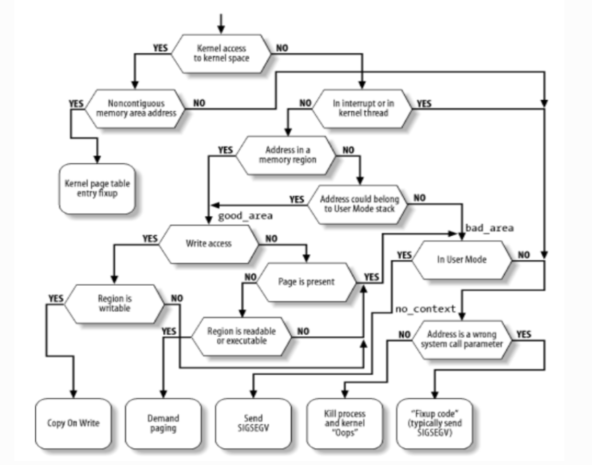

# 开源操作系统训练营第四阶段总结

非常高兴能参加到开源操作系统训练营第四阶段的学习，跟大家一起进步。经历完这四个阶段，自己有非常大的收获，让我理解了操作系统内部的运行机制，通过组件化的管理来实现更现代化的操作系统。

在每周的学习中，非常感谢[陈渝老师](https://github.com/chyyuu) 和 [郑友捷老师](https://github.com/Azure-stars) 给了很多指导和鼓励，同时也要感谢 [AsakuraMizu](https://github.com/AsakuraMizu) 这位开发者对我的 pr 的 review.

## 工作

### Starry-Tutorial-Book

https://github.com/Azure-stars/Starry-Tutorial-Book/pull/16

这是我的第一个 pr, 修复了示例代码中的头文件错误。

### 修复频繁调度导致 irq 无法触发的bug

issues：https://github.com/oscomp/starry-next/issues/29

pr: 
https://github.com/oscomp/arceos/pull/42
https://github.com/oscomp/arceos/pull/44

在本地运行起来 starry 之后，开始尝试 os 排行榜。在添加系统调用的过程中，发现了这个问题。

通过打印 log 的方式排查问题，根据调用链一步一步查看到 `trap_handler` 中， 发现调用这个函数时，已经禁用中断了。已经排查到问题了，就开始寻找解决办法。通过查看 riscv 的文档，了解到 trap 后会禁用中断，又通过查找 Linux 的解决办法，发现Linux 根据 trap 前的中断状态来为trap后设置中断的状态。根据查到的信息开始解决这个问题。

### 为 starry-next 添加 Copy On Write 支持

https://github.com/oscomp/starry-next/pull/55

https://github.com/oscomp/arceos/pull/50

https://github.com/oscomp/arceos/pull/59

>写时复制（Copy-on-write，简称COW）是一种计算机程序设计领域的优化策略。其核心思想是，如果有多个调用者（callers）同时请求相同资源（如内存或磁盘上的数据存储），他们会共同获取相同的指针指向相同的资源，直到某个调用者试图修改资源的内容时，系统才会真正复制一份专用副本（private copy）给该调用者，而其他调用者所见到的最初的资源仍然保持不变。这过程对其他的调用者都是透明的。此作法主要的优点是如果调用者没有修改该资源，就不会有副本（private copy）被创建，因此多个调用者只是读取操作时可以共享同一份资源。

实现目标：

- 物理页帧的引用计数

- 删除页表项的写标志

- handle_page_fault

#### 物理页帧的引用计数

在 arceos 启动，分配一张全局的数组记录所有物理页帧的信息，使用物理页号作为索引

对于 4k 页，每一页对应数组的一个位置。

对于大页（以 2M 大页为例），每一个 2M 大页对应了连续 512 项的数组元素，但是信息存储在第一个元素上。需要查看信息时，索引需要对齐到开始的物理地址所对应的物理页号。

无需全局锁，将锁的粒度细化到对应的页上。

但是大页会存在浪费很多数组的空间。（也许使用 Xarray 是更好的选择, 不过这种结构更复杂了）。

#### handle_page_fault

Linux 的缺页处理：

对内存进行写访问，并且内存区域是可写的，可以触发 cow 缺页。

进行缺页处理时，当引用计数为 1 时，就不需要分配新的页了，为当前 pte 增加写flag.

#### feature 支持

可以通过 feature 可选的开启 cow 支持。

#### 修复 page_table_multiarch 中的错误

在开发中，发现在 aarch64 架构中，触发缺页后，在更换了新的物理页帧后，其仍使用旧的物理页帧，便猜测可能是 tlb 刷新问题。通过查看 ByteOS 和 arm 文档解决。

https://github.com/Mivik/page_table_multiarch/pull/2

#### 进展

与 内核相关 的代码都已经被合并，目前只剩 starry-next 中关于开启 cow 的build 选项和测试代码还未被合并。

这是因为，axsignal 库中未在访问用户地址空间时做检查这一不规范的行为，会导致 cow 在内核中产生缺页。

## 总结

在第四阶段期间，在为 starry 支持新特性的同时，也查看了不少 Linux 源码，硬件文档, 以及其他基于 Rust 的 OS，收获相当丰富。在训练营之前，我对硬件的知识几乎为零，但是在四阶段依然解决了硬件相关的 bug 。硬件文档虽然很多，但很详细，结合 ai 可以帮助缩小范围，快速定位到要查找的地方，我使用这种方法来解决问题。